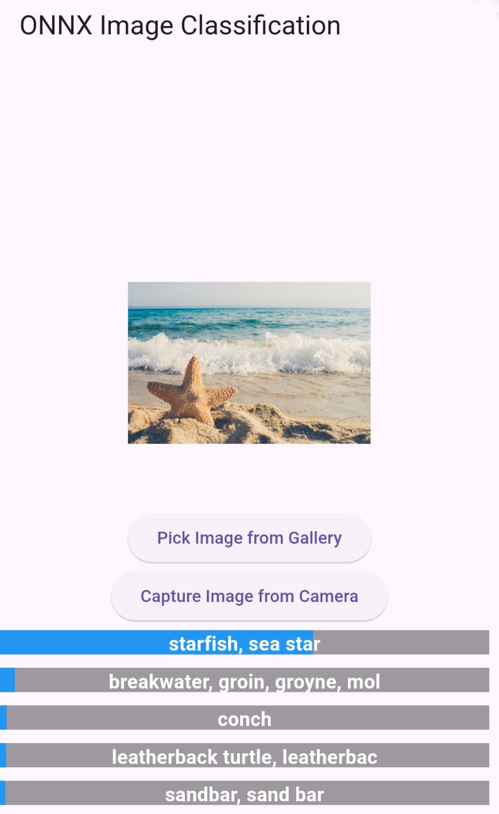

# ONNX Image Classification
This repo contains an example inference flutter app that ports a CNN image classifier to Flutter on device.
For this purpose, we convert Googles `mobilenet`, but it should work for other models as well.

## Getting Started
To convert your model, or any HF model, to the `onnx` format, see the python-notebook `model_to_onnx/convert_model.ipynb`.
Run the flutter application with `flutter run` after installing all dependencies
